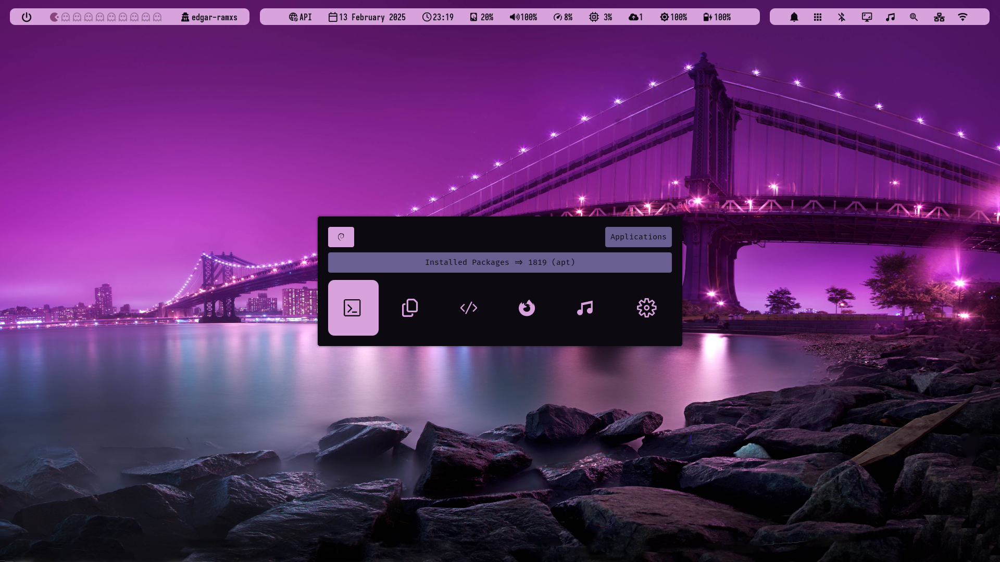
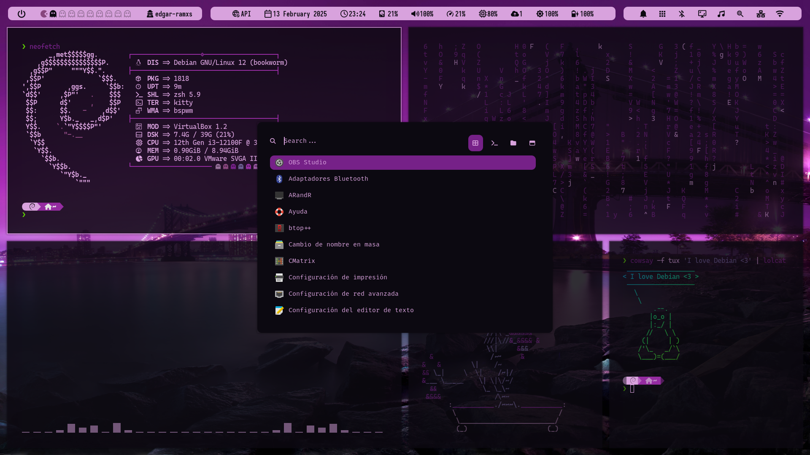
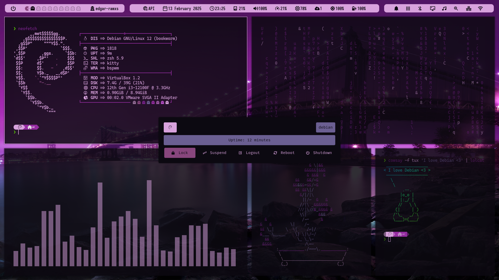

<div align="center">
  
  
</div>

# Introduction
🙋‍♂️ Hi, I've created this installation process automation using a `Tiling Window Manager`, in this case `Bspwm` preferably, to customize a minimalist Debian system environment from scratch.

⛳ Initially, I decided to create these dotfiles for use in minimal environments of Debian-based distributions such as Kali Linux, Parrot, Ubuntu, and others. 🫰 However, I am going to prepare the setup and automatic installation for other popular distributions such as Arch, Fedora, etc.

> [!NOTE]  
> 🧑‍💻 These dotfiles have been tested on the following distributions: `Debian`, `Kali Linux`, `Ubuntu`, `Linux Mint`.

<div align="center">

  |     | Component               | Package                                                     |
  |-----|-------------------------|-------------------------------------------------------------|
  |💻| **Window Manager**         |  [Bspwm](https://github.com/baskerville/bspwm)              |
  |🐱| **Terminal**               |  [Kitty](https://sw.kovidgoyal.net/kitty/)                  |
  |🦊| **Shell**                  |  [Zsh](https://ohmyz.sh/)                                   |
  |🎼| **Compositor**             |  [Picom](https://github.com/yshui/picom)                    |
  |💈| **Bar**                    |  [Polybar](https://github.com/polybar/polybar)              |
  |🔍| **Menu Launcher**          |  [Rofi](https://github.com/davatorium/rofi)                 |
  |🔔| **Notify Daemon**          |  [Dunst](https://github.com/dunst-project/dunst)            |
  |📝| **Editor**                 |  [Visual studio code](https://code.visualstudio.com/)       |
  |🚀| **Browser**                |  [Firefox](https://www.mozilla.org/)                        |
  |📂| **File Manager**           |  [Thunar](https://wiki.archlinux.org/title/Thunar)          |
  |🎨| **Wallpaper Manager**      |  [Nitrogen](https://wiki.archlinux.org/title/Nitrogen)      |
  |🍉| **Colors**                 |  [Pywal](https://github.com/dylanaraps/pywal)               |
</div>


## Pre-installation
```bash
# repository organization
.
├── installer.sh
├── README.md
├── assets          # photos, documents, etc. to view the environment
├── config          # Configuring applications, managers and tools
├── home            # Shell configuration and others
├── local           # binaries or scripts for use within the environment
├── packages        # List of packages to be installed
├── scripts         # scripts to install or update tools
└── wallpapers      # wallpapers for the environment    
```
> [!TIP]
> There are automated scripts to install, configure and download some tools for the custom environment inside the `scripts/` directory. 📭 For example, there is a script called `debian_testing.sh` that upgrades to the debian testing branch, where it can be used at the beginning or end of the automated installation, if you want to switch to the testing branch.


## Installation
```bash
sudo apt install -y git vim
git clone https://github.com/edgar-ramxs/dotfiles-bspwm.git ~/dotfiles-bspwm
cd ~/dotfiles-bspwm
chmod +x installer.sh
./installer.sh -s [bash|zsh] -r [1920x1080|1366x768]
```


## Post-installation
> [!IMPORTANT]  
> Read the [KEYBINDING.md](assets/KEYBINDING.md) to find out what the keyboard shortcuts are that were configured by me.


## Visuals




> [!TIP]
> Some of the best repositories for bspwm configurations, themes, and other stuff are listed in the [REFERENCES.md](assets/REFERENCES.md) file.


## To Do
- [ ] Adding themes to Grub
- [ ] Accommodate the function of symbolic links
- [ ] Finishing the Picom configuration with its animations
- [ ] Add GTK themes and set the option to choose in the installer
- [ ] Set up a development branch for the repository
- [ ] Adapt environment and self-installation for Arch and Fedora
- [ ] Linux mintm problemas con dunst in polybar
- [ ] Colorsscripts error directory
- [x] Scratch my balls
