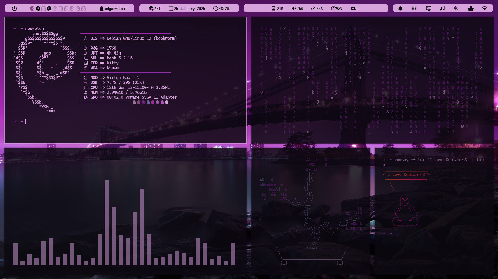
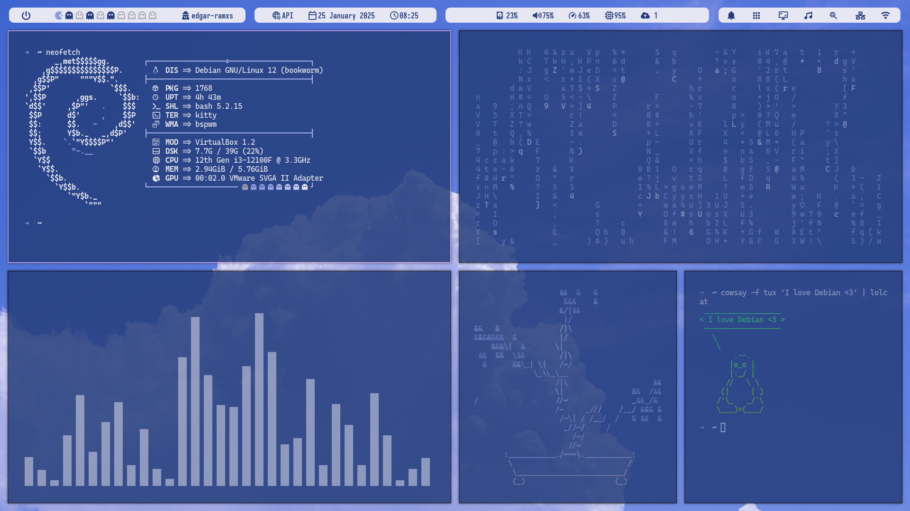
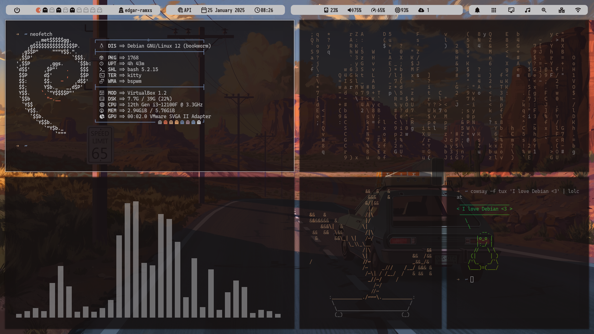
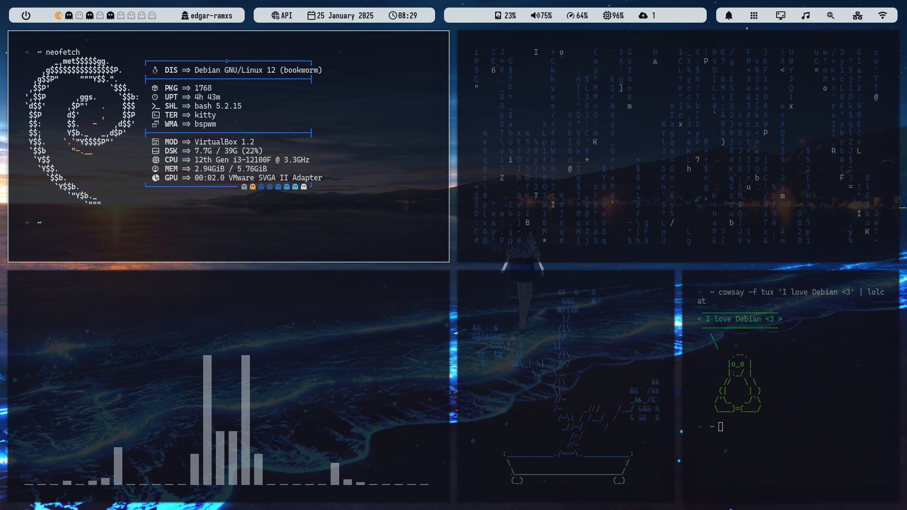
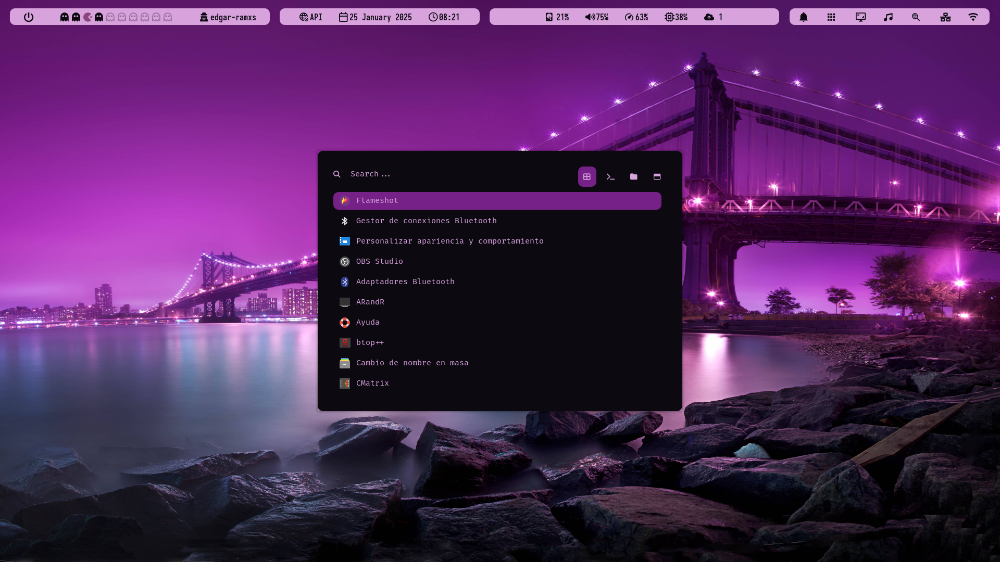
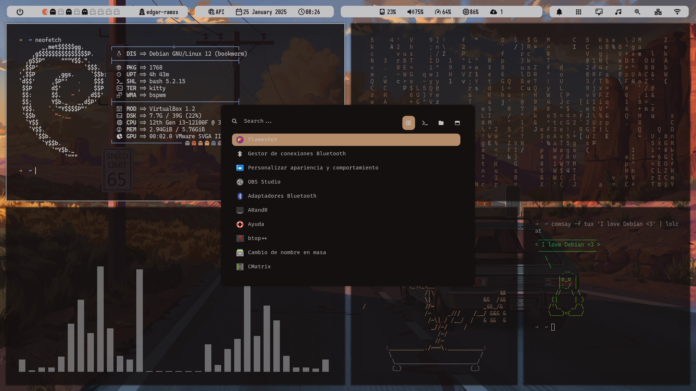
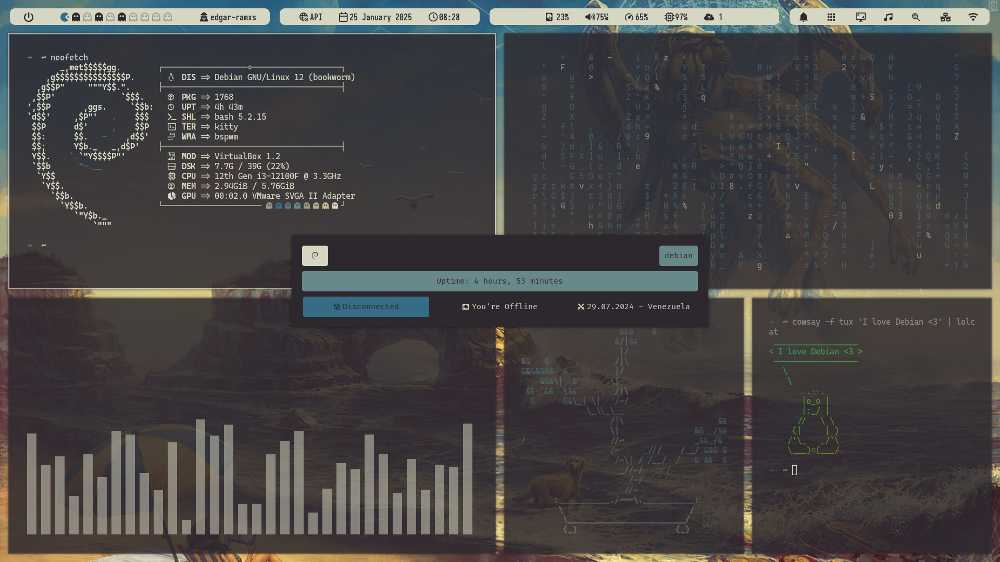
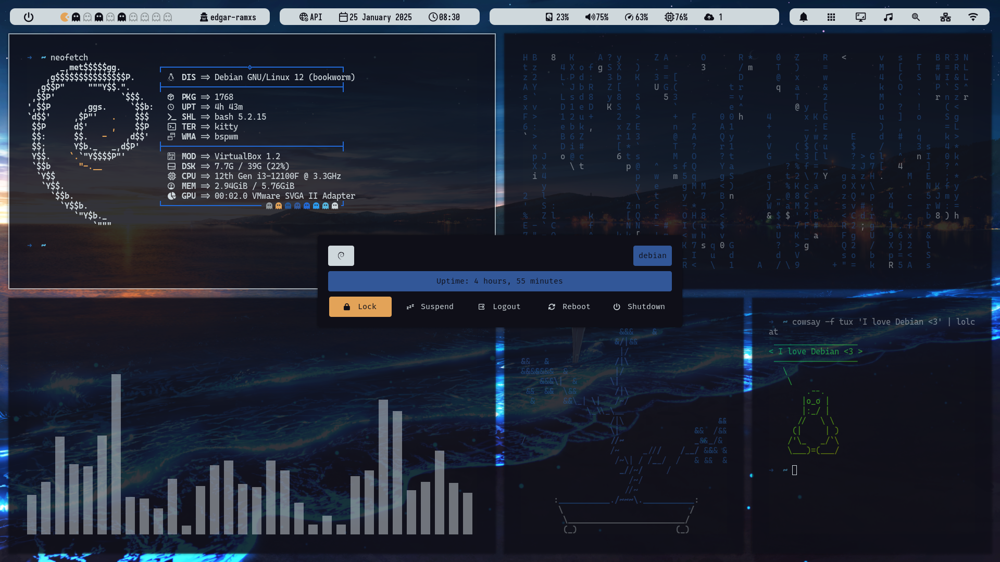

<div align="center">
  
  
</div>

# Introduction
Hello, I created these dotfiles to use the BSPWM window manager. The idea came up when I decided to install a minimal version of Debian. Why? I'm not sure, it was a bit of a crazy impulse, but I stuck with the idea, and it eventually evolved. In the end, I decided to create these dotfiles to use them in minimal environments of Debian-based distributions like Kali Linux, Parrot, Ubuntu, and others.

- These dotfiles have been tested on the following distributions:
  + [Debian](https://www.debian.org/)
  + [Kali Linux](https://www.kali.org/)

> NOTE: Don't use the installer, it contains some problems. Please, if you want to use my dotfiles, use the files manually.


## Pre-installation
As of **October 2024**, if you are using **Debian 12**, some packages may not be available. Therefore, it is recommended to update the kernel and migrate to an environment with **Debian 13 (Trixie)** by performing a full system upgrade.

To do this, you can use the script located in the `debian_bookworm_to_trixie.sh` directory, and once the upgrade is complete, continue with the installation.

You can start by reviewing the packages using the `install_packages` function, editing it to check if the packages are available in the repositories. This is useful if you prefer not to upgrade to Debian 13 (Trixie).


## Post-installation
Read the [KEYBINDING.md](KEYBINDING.md) to find out what the keyboard shortcuts are that were configured by me.


## Installation
```bash
    git clone https://github.com/edgar-ramxs/dotfiles-bspwm.git ~/dotfiles-bspwm
    cd ~/dotfiles-bspwm
    chmod +x installer.sh
    ./installer.sh
```

## Details
<div align="center">

  |     | Component                 | Package                                                     |
  | --- | ------------------------- | ----------------------------------------------------------- |
  | 💻 | **Window Manager**         |  [Bspwm](https://github.com/baskerville/bspwm)              |
  | 🐱 | **Terminal**               |  [Kitty](https://sw.kovidgoyal.net/kitty/)                  |
  | 🦊 | **Shell**                  |  [Zsh](https://ohmyz.sh/)                                   |
  | 🎼 | **Compositor**             |  [Picom](https://github.com/yshui/picom)                    |
  | 💈 | **Bar**                    |  [Polybar](https://github.com/polybar/polybar)              |
  | 🔍 | **Menu Launcher**          |  [Rofi](https://github.com/davatorium/rofi)                 |
  | 🔔 | **Notify Daemon**          |  [Dunst](https://github.com/dunst-project/dunst)            |
  | 📝 | **Editor**                 |  [Visual Studio Code](https://code.visualstudio.com/)       |
  | 🚀 | **Browser**                |  [Firefox](https://www.mozilla.org/)                        |
  | 📂 | **File Manager**           |  [Thunar](https://wiki.archlinux.org/title/Thunar)          |
  | 🎨 | **Wallpaper Manager**      |  [Nitrogen](https://wiki.archlinux.org/title/Nitrogen)      |
  | 🍉 | **Colors**                 |  [Pywal](https://github.com/dylanaraps/pywal)               |

</div>


| Visuals |
|:-:|
|  |
|  |
|  |
|  |

| Applets |
|:-:|
|  |
|  |
|  |
|  |
|  |
|  |


## To Do's
- [x] Scratch my balls
- [ ] Terminate the automatic installer
- [ ] Adapt the dotfiles for all possible Debian based distros


## Credits
<div align="left">
  <table>
    <thead>
      <tr>
        <th>Users</th>
        <th>Repositories</th>
        <th>Referenced</th>
      </tr>
    </thead>
    <tbody>
      <tr>
        <td><strong>😎 @ZLCube</strong></td>
        <td><a href="https://github.com/ZLCube/KaliBspwm">📝 Link</a></td>
        <td>📦 design, auto-installer, bspwm config, ethical hacking.</td>
      </tr>
      <tr>
        <td><strong>😎 @thegoodhackertv</strong></td>
        <td><a href="https://github.com/thegoodhackertv/hackerpwm">📝 Link</a></td>
        <td>📦 auto-installer, bspwm config, ethical hacking.</td>
      </tr>
      <tr>
        <td><strong>😎 @AlvinPix</strong></td>
        <td><a href="https://github.com/AlvinPix/bspwm">📝 Link</a></td>
        <td>📦 auto-installer, bspwm config, ethical hacking.</td>
      </tr>
      <tr>
        <td><strong>😎 @RoccoRakete</strong></td>
        <td><a href="https://github.com/RoccoRakete/bspwm-gruvbox">📝 Link</a></td>
        <td>📦 polybar, auto-installer, bspwm config.</td>
      </tr>
      <tr>
        <td><strong>😎 @pznguin-kyun</strong></td>
        <td><a href="https://github.com/pznguin-kyun/pengurice">📝 Link</a></td>
        <td>📦 auto-installer, bspwm config.</td>
      </tr>
      <tr>
        <td><strong>😎 @zoddDev</strong></td>
        <td><a href="https://github.com/zoddDev/dotfiles">📝 Link</a></td>
        <td>📦 design, polybar, auto-installer, bspwm config, packages.</td>
      </tr>
      <tr>
        <td><strong>😎 @moonlight-coffee</strong></td>
        <td><a href="https://github.com/moonlight-coffee/happypinky">📝 Link</a></td>
        <td>📦 bspwm config, polybar, scripts.</td>
      </tr>
      <tr>
        <td><strong>😎 @Ghost1nTh3SSH</strong></td>
        <td><a href="https://github.com/Ghost1nTh3SSH/dotfiles">📝 Link</a></td>
        <td>📦 polybar, auto-installer, bspwm config.</td>
      </tr>
      <tr>
        <td><strong>😎 @ohxxm</strong></td>
        <td><a href="https://github.com/ohxxm/dotfiles">📝 Link</a></td>
        <td>📦 picom, polybar, bspwm config, widgets, debian.</td>
      </tr>
      <tr>
        <td><strong>😎 @Prayag2</strong></td>
        <td><a href="https://github.com/Prayag2/dotfiles">📝 Link</a></td>
        <td>📦 themes, design, bspwm config, polybar, lxsession, config themes.</td>
      </tr>
      <tr>
        <td><strong>😎 @sebasruiz09</strong></td>
        <td><a href="https://github.com/sebasruiz09/Arch-BSPWM">📝 Link</a></td>
        <td>📦 auto-install, bspwm config, polybar, conky.</td>
      </tr>
      <tr>
        <td><strong>😎 @MarioRRom</strong></td>
        <td><a href="https://github.com/MarioRRom/bspwm-dotfiles">📝 Link</a></td>
        <td>📦 auto-installer, polybar, bspwm config, widgets.</td>
      </tr>
      <tr>
        <td><strong>😎 @Battlesquid</strong></td>
        <td><a href="https://github.com/Battlesquid/dotfiles">📝 Link</a></td>
        <td>📦 auto-installer, polybar, bspwm config, widgets, betterlockscreen.</td>
      </tr>
      <tr>
        <td><strong>😎 @ayamir</strong></td>
        <td><a href="https://github.com/ayamir/bspwm-dotfiles">📝 Link</a></td>
        <td>📦 design, themes, polybar, bspwm config.</td>
      </tr>
      <tr>
        <td><strong>😎 @gh0stzk</strong></td>
        <td><a href="https://github.com/gh0stzk/dotfiles">📝 Link</a></td>
        <td>📦 themes, design, auto-installer, bspwm config.</td>
      </tr>
    </tbody>
  </table>
</div>


<!-- Another dotfiles for bspwm
https://github.com/drewgrif/debian-installers
https://github.com/drewgrif/bookworm-scripts
https://github.com/justleoo/dotfiles -> bspwm config
https://github.com/mmsaeed509/bspwm-dots


https://github.com/aadityasinha-dotcom/dotfile -> configs
https://github.com/K4rlosReyes/arch-bspwm -> arch install guide, bspwm config
https://github.com/radstevee/dotfiles -> bspwm config
https://github.com/nameCh3ll/rice
https://github.com/saimoomedits/bspwm-first-rice -> bspwm config
https://github.com/DominatorXS/LinuxDotz -> bspwm config


https://github.com/ChrisTitusTech/Debian-titus -> auto-installer, debian.
https://github.com/lostalejandro/bspwm -> auto-installer, debian, bspwm config.
https://github.com/Alien-Tec/debian-dotfiles -> auto-installer, bspwm config.
https://github.com/hidayry/dotfiles-bspwm -> bspwm config, debian. 
-->
